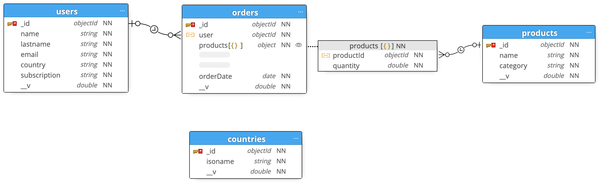
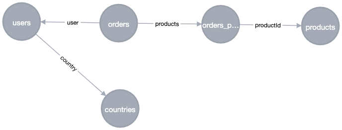
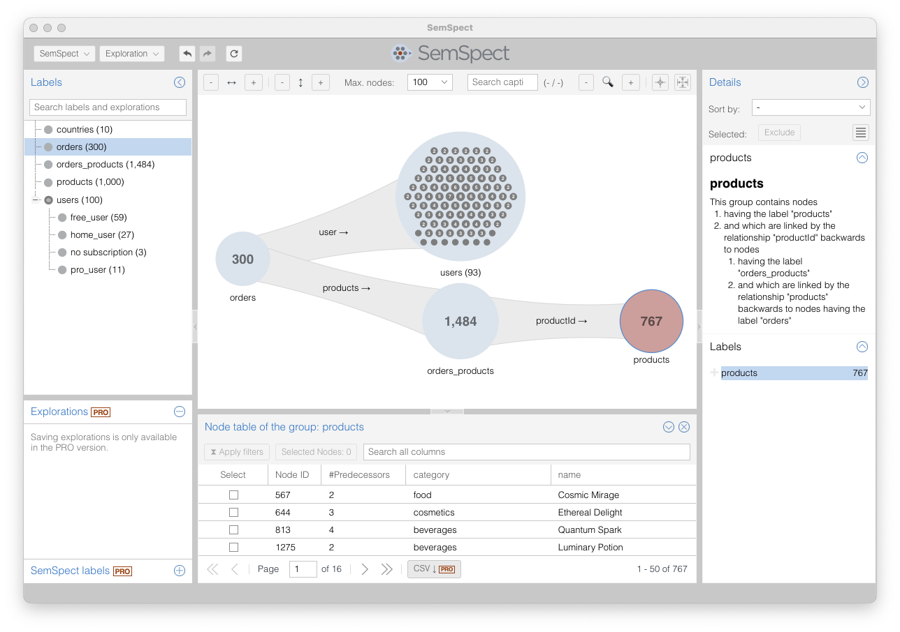

# Populate MongoDB with sample data

The following briefly describes the complete workflow of mongo2neo4j using randomly generated sample data:

1. generation of sample data and import into MongoDB
2. extraction from MongoDB, transformation and import into Neo4j
3. exploration with SemSpect

## Preparation

You need to have [Node.js](https://nodejs.org/en/download) and npm installed on your system. Furthermore the data generator requires the mongoose library:

```
# npm install mongoose
```

## Generate data and load into MongoDB

The sample data simulates a typical web application using to the [MEAN-stack](https://en.wikipedia.org/wiki/MEAN_(solution_stack)) with the help of the [mongoose](https://mongoosejs.com/) object modeling framework. The data set contains users with different subscriptions who have placed orders consisting of a set of products.

In case your MongoDB deamon is set up and running with default setting just call the following to create and populate a MongoDB databases called `mydatabase`:

```
# node generateDummyData.js
```

You can supply host, port and the database identifier when required:

```
# node generateDummyData.js [host [port [database]]]
```

The resulting database contains four collections (manually edited schema generated with [Moon Modeler](https://www.datensen.com/data-modeling/moon-modeler-for-databases.html)):



## Alternative: skip generation and just load DB dump

You can skip the generation process and directly import the additionally supplied database dump with:

```
# mongorestore --drop --gzip --archive=./MongooseEx_dump.gz
```

Use `--uri='mongodb://localhost:27017'` to set host and port.

# Extract from MongoDB, transform and load into Neo4j

## Preparation

The Neo4j application must be installed. The most easiest way is to download and install [Neo4j Desktop](https://neo4j.com/download-center/#desktop) which is a desktop UI that allows to manage Neo4j DBMS on your local system. Furthermore, it's the most comfortable way of installing the [SemSpect Graph App](https://doc.semspect.de/docs/neo4j-graph-app/) for Neo4j.

Once you have installed Neo4j Desktop:

1. [create a local DBMS](https://neo4j.com/docs/desktop-manual/current/operations/create-dbms/)
2. [install the SemSpect Graph App for Neo4j Desktop and the plugin for the created DBMS](https://doc.semspect.de/docs/neo4j-graph-app/installation/)
3. start the DMBS

## Read the MongoDB databases and import into Neo4j

When both - MongoDB and Neo4j - are running with the default settings you simply can load the data from MongoDB and import into Neo4j just by specifying the Neo4j password (here we use the default user `neo4j`) and the MongoDB database (using the `mydatabase` database that was created by the generation script as default). 

```
# mongo2neo4j --neo4j_password=<your-password> mydatabase --conf mongo2neo4j.conf
```

The configuration file `mongo2neo4j.conf` is optional but shows some key configurations that typically occur in most use cases (see the [Script Arguments](https://github.com/MAKOMO/mongo2neo4j/wiki/Script-Arguments) for a full list of options):

```
{
    "chunk_size": 1000,
    "sublabels": [
        "users.subscription._user,`no subscription`"
    ],
    "relations": [
        "users.country,countries.isoname"
    ]
}
```

The **sublabels configuration** creates an additional Neo4j label for the value found in the subscription field (which are either `free`, `home`, `pro` or no value in our sample data) for each object in the `user` collection. A postfix `_user` will be added to each label and the objects which do not have any value will get the `no subscription` label.

The **relations configuration** furthermore adds an additional relationship to the Neo4j graph from objects in the `user` collection to objects in the `countries` collection whenever the field `country` matches the field `isoname`.

Given this configuration the resulting Neo4j graph schema looks as follows (shows the labels used in the graph data and all relationships in between them):



The objects of each collection get at least one Neo4j label named after the collection name (`user`, `orders`, `products`, `countries`). However, there is an additional label called `orders_products`. That label is created by mongo2neo4j automatically and assigned to each JSON object in the array of the products slot of the objects in the orders collection (gray box in the picture above).

Note: you can skip data generation and data import by [importing the also supplied Neo4j dump](https://neo4j.com/docs/desktop-manual/current/operations/create-from-dump/) (file `neo4j.dump`) directly into a Neo4j DBMS.

# Explore the graph data with SemSpect

Now open the SemSpect Graph App and explore the graph by picking a label from the tree view on the left and dropping it into the exploration pane in the center. Expand the graph exploration by successively expanding the relationships.




